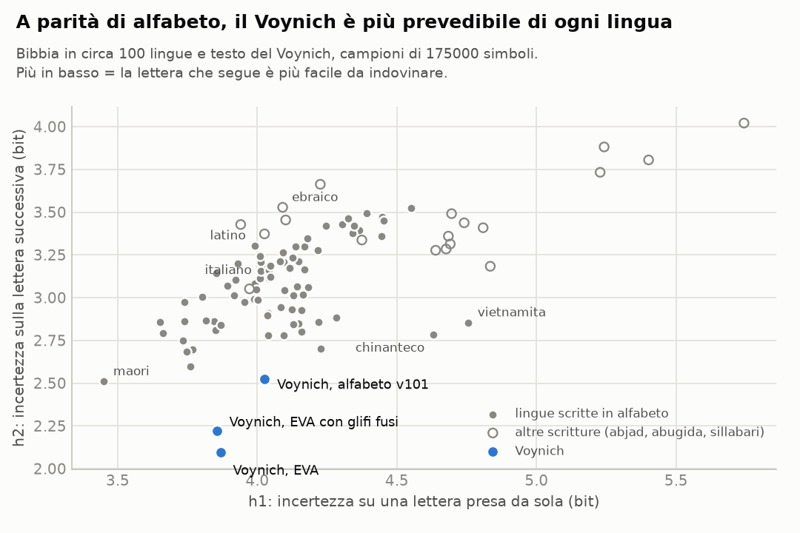
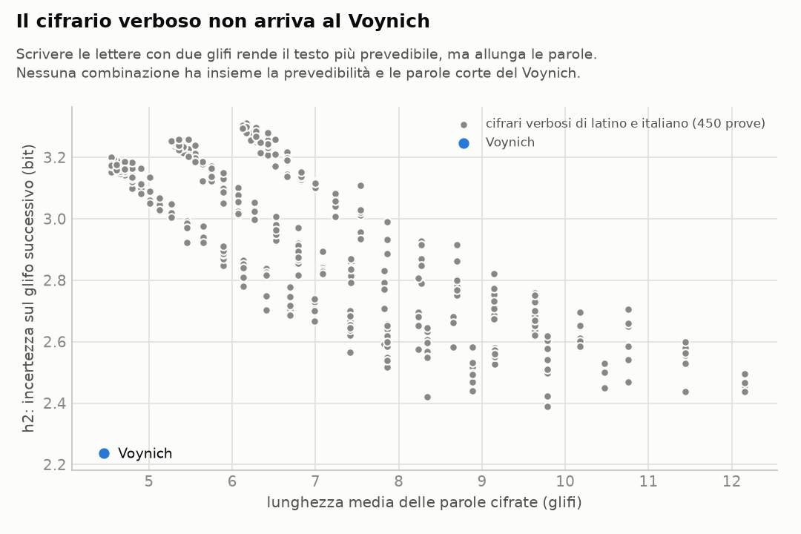
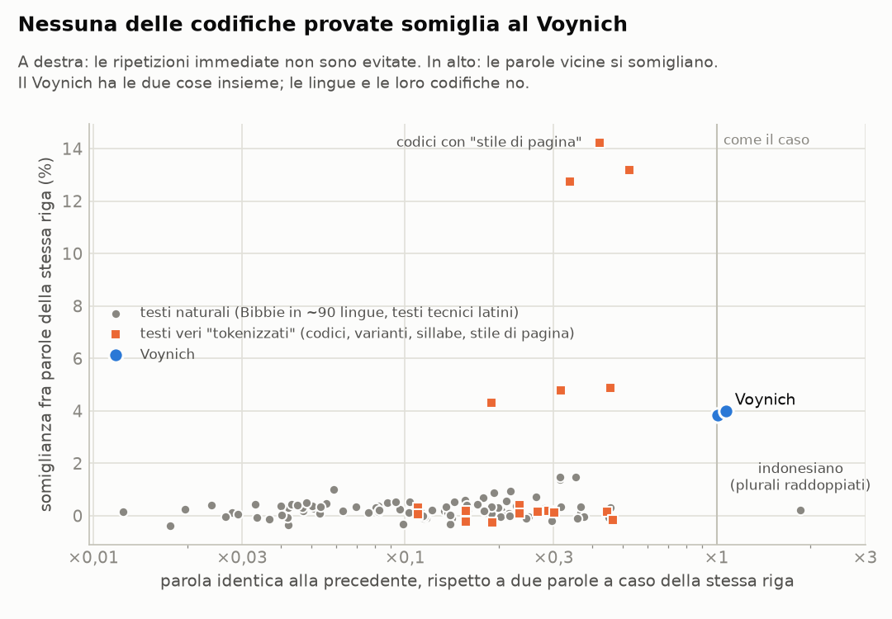
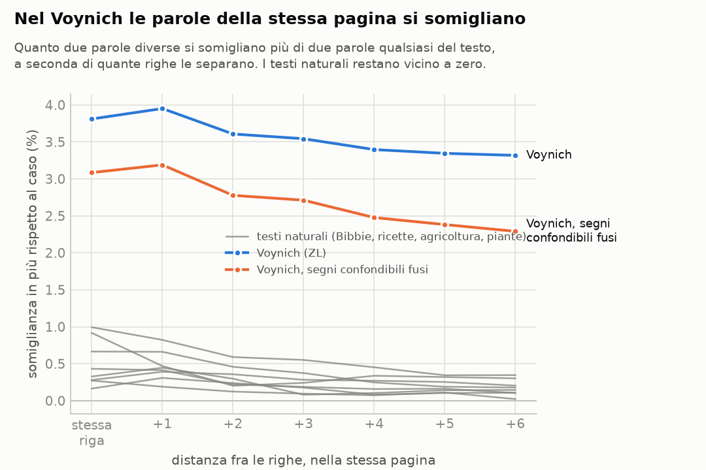

# Il manoscritto Voynich, messo alla prova

Questa cartella non c'entra col sito dei parlamentari: è un lavoro a parte sul
manoscritto Voynich (Beinecke MS 408), un codice su pergamena datata al
radiocarbonio fra il 1404 e il 1438, scritto in un alfabeto che nessuno ha
mai letto.

**Qui non c'è una decifrazione.** Ci sono nove esperimenti ripetibili che
mettono alla prova un'idea precisa: che il testo non sia una lingua scritta con
un alfabeto normale, ma qualcosa di "tokenizzato", cioè fatto di unità più
grandi delle lettere (gruppi di segni per una lettera, codici per una parola,
sillabe). Ogni numero si rifà con i comandi in fondo alla pagina.

## In breve

**1. La lettera successiva è davvero troppo prevedibile per un alfabeto normale,
ma quanto dipende da come si contano i segni.** Nel testo del Voynich, sapere un
segno aiuta a indovinare il successivo più che in qualsiasi lingua del campione,
la Bibbia in circa 100 lingue. Nell'alfabeto EVA, anche fondendo i segni
composti, l'incertezza sul segno successivo (h2) è 2,2 bit. Le lingue con un
alfabeto di taglia simile stanno fra 2,6 e 3,3: il latino a 3,3, l'italiano a 3,2,
i testi tecnici latini fra 3,2 e 3,4. Il Voynich resta fuori anche togliendo gli
spazi (2,5 contro 2,9–3,5), e fra una porzione di testo e l'altra i numeri ballano
appena 0,01–0,03 bit.

Con la trascrizione di Glen Claston (alfabeto v101), che conta come un segno solo
alcuni gruppi che l'EVA spezza (per esempio le serie di *i* in *aiin*), il
distacco si riduce. Con gli spazi siamo a 2,5 contro 2,8–3,3, ancora fuori; solo
il maori arriva a 2,5, ma con un alfabeto di 15 lettere. Senza spazi siamo a 2,9
contro 2,8–3,6, cioè al margine basso delle lingue. Quindi due cose:
- una parte della prevedibilità dipende da come si tagliano i segni. È proprio
  l'idea "tokenizzata": le unità vere sono più grandi delle lettere EVA;
- un'altra parte viene dai confini di parola, perché le parole del Voynich
  cominciano e finiscono con pochissimi segni.

Una sostituzione semplice (una lettera, un segno) non cambia questi numeri, né con
gli spazi né senza: per le lingue del campione è esclusa.

<picture>
  <source media="(prefers-color-scheme: dark)" srcset="risultati/e01_prevedibilita-scuro.png">
  
</picture>

**2. Il cifrario "verboso" non ci arriva.** L'idea più semplice di testo
tokenizzato è che ogni lettera sia scritta con due o tre segni: così il testo
diventa più prevedibile. Ma diventa anche più lungo. Su 450 cifrari di questo
tipo applicati a latino e italiano, nessuno arriva alla prevedibilità del
Voynich, e quelli che ci vanno più vicino (h2 fra 2,4 e 2,5) hanno parole di
8–10 segni, il doppio delle sue (4,5). Perché un cifrario del genere producesse
le parole del Voynich, il testo in chiaro dovrebbe avere parole di due lettere in
media.

<picture>
  <source media="(prefers-color-scheme: dark)" srcset="risultati/e07_compromesso_verboso-scuro.png">
  
</picture>

**3. Le parole del Voynich non si comportano come parole cifrate di un testo
vero.** C'è un modo di cifrare che riproduce benissimo le lettere del Voynich:
sostituire ogni parola di un testo latino con una parola del Voynich di pari
frequenza. Le lettere diventano quelle del Voynich, e il vocabolario è vario
quanto quello di una lingua, come nel Voynich. Eppure il risultato non somiglia
al Voynich, per due motivi. Nessuna delle codifiche provate li riproduce insieme:

- **le lingue evitano di ripetere subito la stessa parola, il Voynich no.** Nel
  Voynich una parola è identica alla precedente tanto spesso quanto due parole
  qualsiasi della stessa riga (×1,0). Nelle lingue la grammatica lo impedisce
  quasi sempre: su 95 testi naturali la mediana è ×0,12. Fa eccezione solo
  l'indonesiano, che forma il plurale raddoppiando la parola (*orang-orang*).
  Qualsiasi codice che trasformi ogni parola sempre nello stesso modo conserva
  questa proprietà, e infatti tutte le codifiche restano fra ×0,1 e ×0,5. Non
  dipende da parole brevissime: le ripetute sono parole piene come *chol*,
  *qokeedy*, *daiin*;
- **le parole della stessa pagina si somigliano nella grafia.** Due parole diverse
  della stessa riga, o di righe vicine, si somigliano il 4% più di due parole
  qualsiasi del testo. Nei testi naturali si va da −0,4% a 1,5%, e il massimo
  viene dalle lingue bantu (zulu, xhosa), dove le parole di una frase concordano
  nel prefisso. Circa quattro quinti dell'effetto vengono dalla pagina intera, il
  resto dalle righe più vicine.
  Tiene con due trascrizioni, dentro la lingua A e dentro la lingua B di Currier, e
  anche fondendo i segni che i trascrittori confondono più spesso. Un codice in cui
  lo scriba cambia abitudini di scrittura a ogni pagina (*ch* al posto di *sh*,
  *q* in testa...) riproduce questa omogeneità, anche troppo. Ma allora la
  somiglianza è la stessa a qualsiasi distanza fra le righe, mentre nel Voynich
  cala. Il vocabolario diventa più vario di quello del Voynich e le ripetizioni
  immediate restano evitate.

<picture>
  <source media="(prefers-color-scheme: dark)" srcset="risultati/e09_sintesi-scuro.png">
  
</picture>

**4. Due cose che sembravano anomalie e non lo sono.** Confrontato con la Bibbia,
il Voynich sembrava avere pochissima sintassi (una parola dice poco sulla
successiva). Ma i testi tecnici latini ne hanno altrettanto poca: era la Bibbia a
essere un confronto sbagliato, perché è molto formulaica. E la "copiatura" fra
parole adiacenti di cui parlano alcuni studi, a guardarla bene, non riguarda le
parole adiacenti: riguarda la pagina.

**5. Una cosa che non ha funzionato.** Abbiamo provato a generare un testo che si
copia da solo, sul modello proposto da Timm e Schinner (2020): chi scrive ricopia
una parola delle righe sopra e la ritocca. La nostra versione semplificata non
riesce a riprodurre il vocabolario del Voynich e dopo molte copie degenera in
parole troppo corte. Non è una prova né a favore né contro quell'ipotesi.

<picture>
  <source media="(prefers-color-scheme: dark)" srcset="risultati/e05_righe-scuro.png">
  
</picture>

## Che cosa vuol dire per l'ipotesi "tokenizzata"

Metà dell'idea regge e metà no.

Regge che il Voynich **non è una lingua scritta con un alfabeto normale**: i suoi
segni si combinano come i pezzi di un sistema, non come lettere, e contandoli a
gruppi più grandi il testo si avvicina alle lingue. In questo senso stretto,
"tokenizzato" è una buona descrizione.

Non regge la versione più naturale dell'idea, cioè che **ogni parola del Voynich
stia al posto di una parola di un testo in prosa**, attraverso un codice, un
cifrario verboso, delle sillabe o delle varianti. Tutte queste codifiche
conservano il modo in cui una lingua mette in fila le parole, e il Voynich non le
mette in fila così.

Restano tre possibilità, che questi esperimenti non sanno ancora distinguere:

1. **un contenuto che non è prosa**: elenchi, tabelle, cataloghi, formule, dove
   ripetere subito una voce è normale e ogni pagina ha il suo lessico, scritti con
   un sistema a unità più grandi delle lettere;
2. **una scrittura le cui convenzioni cambiano da pagina a pagina** e i cui spazi
   non separano parole del testo in chiaro. Un codice "con stile di pagina" riproduce
   l'omogeneità delle pagine, ma non le ripetizioni né la gradazione fra righe vicine;
3. **nessun messaggio**: un testo prodotto da una procedura, per esempio copiando e
   variando quello che si è appena scritto.

## Cosa fare adesso

- **Testi "a elenco"** come termine di paragone: ricettari fatti di liste,
  cataloghi di stelle, glossari, tavole. Se anche loro non evitano le ripetizioni
  e hanno pagine omogenee, la possibilità 1 si rafforza.
- **L'algoritmo completo di Timm e Schinner**, invece della nostra versione
  ridotta, per mettere davvero alla prova la possibilità 3.
- **Le immagini.** Le scansioni della Beinecke da questo ambiente non si
  raggiungono. Con quelle si possono usare come appigli le etichette accanto ai
  disegni e i nomi dei mesi scritti in caratteri latini nelle pagine dello zodiaco.
- **La posizione nella riga e nel paragrafo**: la prima e l'ultima parola di ogni
  riga del Voynich hanno statistiche proprie, e vanno studiate a parte.

## Gli esperimenti

| # | domanda | risultato | dettagli |
|---|---|---|---|
| 1 | La lettera successiva è troppo prevedibile? | Sì a parità di alfabeto; con i segni contati a gruppi (v101) e senza spazi arriva al margine delle lingue | [e01](risultati/e01_prevedibilita.md) |
| 2 | Come si comportano le parole, rispetto a ~100 lingue? | Vocabolario nella norma; ripetizioni e somiglianze fuori norma (da rileggere con 3–5) | [e02](risultati/e02_impronta.md) |
| 3 | Il genere del testo spiega la "poca sintassi"? | Sì: i testi tecnici latini ne hanno altrettanto poca | [e03](risultati/e03_genere.md) |
| 4 | Le parole adiacenti si copiano? | No: è la riga (e la pagina) a essere omogenea | [e04](risultati/e04_vicinato.md) |
| 5 | Quanto dura la somiglianza fra righe? | Tutta la pagina, un po' di più fra righe vicine | [e05](risultati/e05_righe.md) |
| 6 | Gli strumenti ritrovano le lingue A e B di Currier? | Sì, 98,5% delle pagine | [e06](risultati/e06_currier.md) |
| 7 | Un testo vero codificato somiglia al Voynich? | No, con nessuna delle codifiche provate | [e07](risultati/e07_codifiche.md) |
| 8 | Un testo che si copia da solo somiglia al Voynich? | La nostra versione non ci riesce | [e08](risultati/e08_autocitazione.md) |
| 9 | Le due anomalie in un grafico | Il Voynich sta da solo | [e09](risultati/e09_sintesi.md) |

## Come rifare tutto

```sh
pip install -r voynich/requirements.txt
python3 voynich/prepara.py                     # scarica e prepara i testi di confronto
python3 voynich/esperimenti/e01_prevedibilita.py
python3 voynich/esperimenti/e02_impronta.py    # e cosi' via fino a e09
```

Ogni esperimento scrive in `risultati/` un file `.json` con tutti i numeri, una
tabella `.md` e, dove serve, un grafico in versione chiara e scura. I generatori
casuali hanno semi fissi: rifacendo, i numeri tornano uguali.

## Scelte e limiti

- **Trascrizione.** Quella di riferimento è Zandbergen-Landini (versione 3b, maggio
  2025); Takahashi e Glen Claston (alfabeto v101) servono da controllo. Si usa solo
  il testo in paragrafi: etichette, testi in cerchio e raggi restano fuori. Le parole
  con segni illeggibili o rarissimi vengono scartate (lo 0,6%).
- **Segni composti.** Nell'alfabeto EVA alcuni segni del manoscritto sono scritti con
  più lettere (*ch*, *sh*, *cth*, *ckh*, *cph*, *cfh*). Li fondiamo in un segno solo,
  altrimenti il testo sembrerebbe più prevedibile di quanto è.
- **Confronti alla pari.** Ogni misura si confronta su campioni della stessa
  lunghezza, perché molte dipendono dalla lunghezza del campione.
- **La Bibbia come termine di paragone** ha il pregio di avere lo stesso contenuto in
  tutte le lingue e il difetto di essere un genere particolare. Per questo ci sono
  anche i testi tecnici latini, che hanno ribaltato una delle conclusioni.
- **Le immagini non ci sono.** Tutto quello che dipende dai disegni resta fuori.
- **Le fonti** dei dati, con versioni e impronte, sono in [dati/FONTI.md](dati/FONTI.md).
