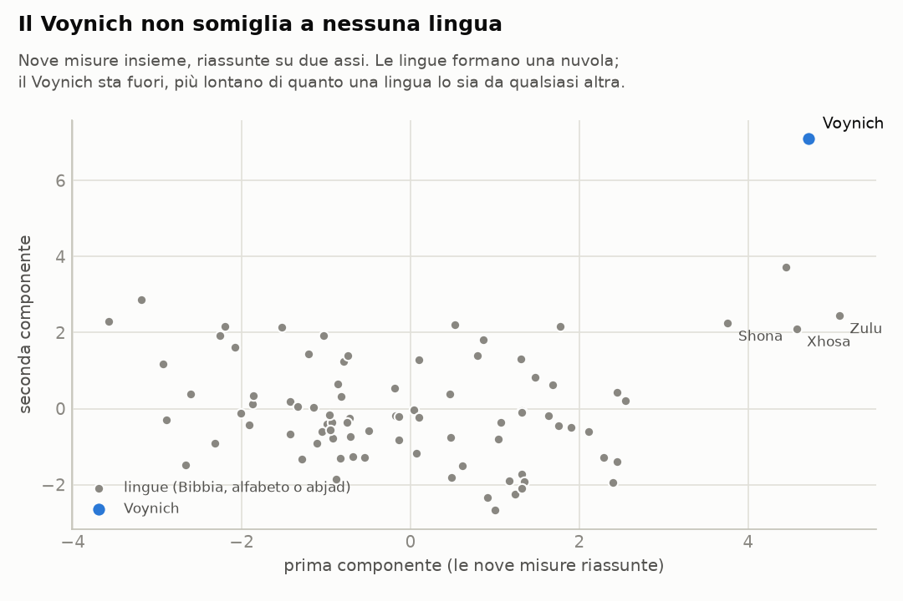

# Il manoscritto Voynich, messo alla prova

Questa cartella non c'entra col sito dei parlamentari: è un lavoro a parte sul
manoscritto Voynich (Beinecke MS 408), un codice su pergamena datata al
radiocarbonio fra il 1404 e il 1438, scritto in un alfabeto che nessuno ha
mai letto.

**Qui non c'è una decifrazione.** Ci sono sedici esperimenti ripetibili, in due
tornate. La prima mette alla prova un'idea precisa: che il testo non sia una
lingua scritta con un alfabeto normale, ma qualcosa di "tokenizzato", cioè fatto
di unità più grandi delle lettere (gruppi di segni per una lettera, codici per
una parola, sillabe). La seconda allarga le analisi e tenta una decifrazione vera,
con i controlli che servono a non illudersi. Ogni numero si rifà con i comandi in
fondo alla pagina.

## In breve

**1. La lettera successiva è davvero troppo prevedibile per un alfabeto normale,
ma quanto dipende da come si contano i segni.** Nel testo del Voynich, sapere un
segno aiuta a indovinare il successivo più che in qualsiasi lingua del campione,
la Bibbia in circa 100 lingue. Nell'alfabeto EVA, anche fondendo i segni
composti, l'incertezza sul segno successivo (h2) è 2,2 bit. Le lingue con un
alfabeto di taglia simile stanno fra 2,6 e 3,3: il latino a 3,3, l'italiano a 3,2,
i testi tecnici latini fra 3,2 e 3,4. Il Voynich resta fuori anche togliendo gli
spazi (2,5 contro 2,9–3,5), e fra una porzione di testo e l'altra i numeri ballano
appena 0,01–0,03 bit.

Con la trascrizione di Glen Claston (alfabeto v101), che conta come un segno solo
alcuni gruppi che l'EVA spezza (per esempio le serie di *i* in *aiin*), il
distacco si riduce. Con gli spazi siamo a 2,5 contro 2,8–3,3, ancora fuori; solo
il maori arriva a 2,5, ma con un alfabeto di 15 lettere. Senza spazi siamo a 2,9
contro 2,8–3,6, cioè al margine basso delle lingue. Quindi due cose:
- una parte della prevedibilità dipende da come si tagliano i segni. È proprio
  l'idea "tokenizzata": le unità vere sono più grandi delle lettere EVA;
- un'altra parte viene dai confini di parola, perché le parole del Voynich
  cominciano e finiscono con pochissimi segni.

Una sostituzione semplice (una lettera, un segno) non cambia questi numeri, né con
gli spazi né senza: per le lingue del campione è esclusa.

<picture>
  <source media="(prefers-color-scheme: dark)" srcset="risultati/e01_prevedibilita-scuro.png">
  
</picture>

**2. Il cifrario "verboso" non ci arriva.** L'idea più semplice di testo
tokenizzato è che ogni lettera sia scritta con due o tre segni: così il testo
diventa più prevedibile. Ma diventa anche più lungo. Su 450 cifrari di questo
tipo applicati a latino e italiano, nessuno arriva alla prevedibilità del
Voynich, e quelli che ci vanno più vicino (h2 fra 2,4 e 2,5) hanno parole di
8–10 segni, il doppio delle sue (4,5). Perché un cifrario del genere producesse
le parole del Voynich, il testo in chiaro dovrebbe avere parole di due lettere in
media.

<picture>
  <source media="(prefers-color-scheme: dark)" srcset="risultati/e07_compromesso_verboso-scuro.png">
  
</picture>

**3. Le parole del Voynich non si comportano come parole cifrate di un testo
vero.** C'è un modo di cifrare che riproduce benissimo le lettere del Voynich:
sostituire ogni parola di un testo latino con una parola del Voynich di pari
frequenza. Le lettere diventano quelle del Voynich, e il vocabolario è vario
quanto quello di una lingua, come nel Voynich. Eppure il risultato non somiglia
al Voynich, per due motivi. Nessuna delle codifiche provate li riproduce insieme:

- **le lingue evitano di ripetere subito la stessa parola, il Voynich no.** Nel
  Voynich una parola è identica alla precedente tanto spesso quanto due parole
  qualsiasi della stessa riga (×1,0). Nelle lingue la grammatica lo impedisce
  quasi sempre: su 95 testi naturali la mediana è ×0,12. Fa eccezione solo
  l'indonesiano, che forma il plurale raddoppiando la parola (*orang-orang*).
  Qualsiasi codice che trasformi ogni parola sempre nello stesso modo conserva
  questa proprietà, e infatti tutte le codifiche restano fra ×0,1 e ×0,5. Non
  dipende da parole brevissime: le ripetute sono parole piene come *chol*,
  *qokeedy*, *daiin*;
- **le parole della stessa pagina si somigliano nella grafia.** Due parole diverse
  della stessa riga, o di righe vicine, si somigliano il 4% più di due parole
  qualsiasi del testo. Nei testi naturali si va da −0,4% a 1,5%, e il massimo
  viene dalle lingue bantu (zulu, xhosa), dove le parole di una frase concordano
  nel prefisso. Circa quattro quinti dell'effetto vengono dalla pagina intera, il
  resto dalle righe più vicine.
  Tiene con due trascrizioni, dentro la lingua A e dentro la lingua B di Currier, e
  anche fondendo i segni che i trascrittori confondono più spesso. Un codice in cui
  lo scriba cambia abitudini di scrittura a ogni pagina (*ch* al posto di *sh*,
  *q* in testa...) riproduce questa omogeneità, anche troppo. Ma allora la
  somiglianza è la stessa a qualsiasi distanza fra le righe, mentre nel Voynich
  cala. Il vocabolario diventa più vario di quello del Voynich e le ripetizioni
  immediate restano evitate.

<picture>
  <source media="(prefers-color-scheme: dark)" srcset="risultati/e09_sintesi-scuro.png">
  
</picture>

**4. Due cose che sembravano anomalie e non lo sono.** Confrontato con la Bibbia,
il Voynich sembrava avere pochissima sintassi (una parola dice poco sulla
successiva). Ma i testi tecnici latini ne hanno altrettanto poca: era la Bibbia a
essere un confronto sbagliato, perché è molto formulaica. E la "copiatura" fra
parole adiacenti di cui parlano alcuni studi, a guardarla bene, non riguarda le
parole adiacenti: riguarda la pagina.

**5. Una cosa che non ha funzionato.** Abbiamo provato a generare un testo che si
copia da solo, sul modello proposto da Timm e Schinner (2020): chi scrive ricopia
una parola delle righe sopra e la ritocca. La nostra versione semplificata non
riesce a riprodurre il vocabolario del Voynich e dopo molte copie degenera in
parole troppo corte. Non è una prova né a favore né contro quell'ipotesi.

<picture>
  <source media="(prefers-color-scheme: dark)" srcset="risultati/e05_righe-scuro.png">
  
</picture>

## Seconda tornata: altre analisi e un tentativo di decifrazione

**6. Il cifrario Naibbe, la migliore proposta attuale, non riproduce il Voynich.**
Nel 2025 Michael Greshko ha pubblicato un cifrario quattrocentesco, fatto a mano con
un mazzo di carte, che trasforma latino e italiano in qualcosa di molto simile al
Voynich: il testo si taglia in pezzi di una o due lettere e ogni pezzo diventa una
"parola", presa da una di sei tabelle. Abbiamo usato il Plinio cifrato da lui e,
con le sue tabelle, abbiamo cifrato Vitruvio e la Bibbia latina e italiana, anche
in una variante in cui le preferenze fra le tabelle cambiano da una pagina
all'altra.
- **Dove somiglia al Voynich:** prevedibilità della lettera (2,2), lunghezza e
  varietà delle parole.
- **Dove no:**
  - parole usate una volta sola: 0,37–0,44 contro 0,68;
  - ripetizioni immediate: ×0,33–0,69 contro ×1,0;
  - omogeneità di pagina: al massimo 2,2%, e piatta, contro il 3,8–4,0% che cala
    con la distanza;
  - legame fra la fine di una parola e l'inizio della successiva: 0,002–0,013
    bit contro 0,19. È meno di qualsiasi lingua.

**7. Gli spazi sono in parte regole di scrittura, in parte facoltativi.** Nel Voynich
lo spazio si prevede per due terzi dal segno che lo precede (66%, contro una mediana
del 17% nelle lingue): certe forme stanno solo a fine parola. E se si uniscono due
parole vicine, nel 9,2% dei casi si ottiene una parola che il manoscritto usa
altrove (4,8% unendo parole a caso; nelle lingue lo 0,1–0,7%). Le parole del
Voynich sono fatte di pezzi che si attaccano e si staccano.
- **Spazi incerti e certi:** fra gli spazi che i trascrittori hanno segnato come
  incerti l'unione torna nel 43,5% dei casi (31% per caso, perché spesso separano
  frammenti brevissimi); fra quelli certi nel 6,1% (3,4% per caso).
- **Giunture morbide:** prima delle parolette in *a* (*aiin*, *ar*, *al*) e dopo
  *o*, l'unione è attestata nel 40–56% dei casi (*s aiin* → *saiin*, *ol chedy* →
  *olchedy*).
- **Giunture dure:** prima di *q* e dopo *m* non lo è quasi mai (0–1%).

Rifare il testo senza gli spazi dubbi non lo avvicina a una lingua.

**8. Tutto considerato, il Voynich non somiglia a nessuna lingua.** Sulle singole
misure a volte sfiora le lingue austronesiane: maori e malgascio sono fra le più
prevedibili, l'indonesiano raddoppia le parole, il tagalog ha un forte legame fra
parole vicine. Ma mettendo insieme nove misure, la sua distanza dalla lingua più
vicina è 9,9 (5,5 senza l'omogeneità di pagina), mentre la lingua più isolata del
campione sta a 4,1 dalla sua vicina. Le lingue più vicine non hanno niente in
comune fra loro: potawatomi, chinanteco, ewe, malgascio. Le misure più anomale:
- **omogeneità di pagina:** +10,7 deviazioni standard;
- **spazio prevedibile:** +5,8;
- **prevedibilità della lettera:** −3,5.

<picture>
  <source media="(prefers-color-scheme: dark)" srcset="risultati/e13_profilo-scuro.png">
  
</picture>

**9. Le etichette dello zodiaco non sono numeri.** Ogni segno ha circa 30 ninfe,
come i gradi del segno o i giorni del mese. Ma le etichette sono quasi tutte diverse
(264 su 299), e anche cercando il punto di partenza migliore del cerchio, quelle
nella stessa posizione in segni diversi non si somigliano più di etichette prese a
caso (p = 0,46). Più della metà comincia con *ot-* o *ok-*, e la loro grafia scivola
con regolarità dai Pesci al Sagittario (da forme in *-al-* a forme in *-eo-*): la
stessa deriva di stile delle pagine.

**10. Un tentativo di decifrazione, con i controlli: nessuna lingua lo legge.**
Abbiamo costruito un attacco da manuale contro l'ipotesi più semplice rimasta in
piedi dopo la prima tornata:
- ogni segno del Voynich vale una lettera di una lingua nota;
- più segni possono valere la stessa lettera, come nei cifrari omofonici o come le
  forme iniziali e finali di certe scritture;
- gli spazi sono spazi.

Per ognuna di quattordici lingue il programma cerca la chiave che rende le parole
del Voynich più simili a parole di quella lingua, contando i segni in due modi
diversi. Le lingue: latino, italiano, tedesco, inglese, francese, spagnolo, ceco,
ungherese, greco, ebraico, arabo, turco, e due lingue lontane che per profilo gli
stanno meno distanti (malgascio e chinanteco; il potawatomi, terzo, è rimasto fuori
perché il testo disponibile è troppo corto).
- **Il metodo funziona.** Su un altro pezzo della stessa Bibbia, cifrato con una
  chiave casuale dello stesso tipo, ritrova il testo: 69–98% di
  parole vere, e da 629 a 5.669 parole diverse ("quid mihi et tibi est
  vade ad prophetas…").
- **Sul Voynich no.** In nessuna lingua escono più del 36% di parole vere, e
  mai più di qualche decina di parole diverse (da 7 a 93), in
  buona parte sempre le stesse tre. È quello che succede quando si "decifra" un testo
  scritto in un'altra lingua: da 4 a 86 parole diverse.
- **L'ordine delle parole non aiuta.** Le coppie di parole vicine decifrate non
  esistono nella lingua più delle stesse parole rimescolate. L'eccezione apparente,
  il tedesco, viene da una chiave degenere: trasforma le parole più frequenti del
  Voynich in *seien*, *er*, *sie* e ne ricalca le ripetizioni (*er er*, *seien sie*).
  È la struttura del Voynich, non un significato: uno scarto così compare anche in
  4 controlli negativi su 14, dove per costruzione non c'è niente
  da leggere.
- **Lo zodiaco non conferma niente.** Nelle sei lingue per cui abbiamo i nomi di mesi
  e segni, un nome giusto compare in 3 pagine su 144 (12 pagine, 6 lingue,
  2 modi di contare i segni). Nomi di altri mesi o segni compaiono fuori posto
  22 volte: puro caso.
- **Un controllo in più.** Lo stesso attacco sul Plinio cifrato col Naibbe, che è
  latino vero ma cifrato con un meccanismo diverso, dà 9% di parole vere e
  53 parole diverse: anche un testo che ha senso, se non è cifrato nel modo
  che l'attacco presuppone, gli sembra vuoto.

Questo esclude una cosa precisa: che il Voynich sia una sostituzione, anche
omofonica, di una di queste lingue con gli spazi al loro posto. Non esclude
cifrari più complessi (il Naibbe stesso, codici, trasposizioni, lettere nulle), né
le lingue non provate. Senza gli spazi (esperimento 16) il nostro attacco non
rompe nemmeno i controlli: lì non possiamo dire niente.

<picture>
  <source media="(prefers-color-scheme: dark)" srcset="risultati/e14_decifrazione-scuro.png">
  
</picture>

## La lista di controllo

Chi propone una decifrazione, un cifrario o un meccanismo che generi il testo deve
riprodurre tutte queste proprietà insieme, misurate come qui (testo in paragrafi
della trascrizione ZL, segni composti fusi). Accanto, i valori dei testi naturali
(la Bibbia in circa 90 lingue in alfabeto o abjad, più otto testi tecnici latini)
e del cifrario Naibbe.

| proprietà | Voynich | testi naturali | Naibbe |
|---|---|---|---|
| incertezza sul segno successivo (h2) | 2,22 bit | 2,6–3,3 a parità di alfabeto | 2,2 ✓ |
| spazio prevedibile dal segno precedente | 66% | 6–100%, mediana 17% | 64% ✓ |
| parole diverse ogni 30.000 | 21% | 3–33% | 17–18% ✓ |
| parole usate una volta sola (hapax) | 68% | 12–72% | 37–44% ✗ |
| parola identica alla precedente, rispetto alla riga | ×1,0 | ×0,01–1,9, mediana ×0,12 | ×0,33–0,69 ✗ |
| somiglianza fra parole della stessa riga | 3,8% | da −0,4% a 1,5% | 0–2,2% ✗ |
| la stessa somiglianza a 6 righe di distanza | 3,4% (cala) | vicino a 0 | piatta ✗ |
| legame fine parola → inizio parola seguente | 0,19 bit | 0,02–0,40, mediana 0,07 | 0,002–0,013 ✗ |
| due parole vicine unite danno una parola esistente | 9,2% (caso 4,8%) | 0,1–0,7%, pari al caso (4 testi) | 1,0% (caso 1,3%) ✗ |

Nessun testo naturale e nessun testo artificiale provato fin qui le ha tutte.

## Che cosa vuol dire per l'ipotesi "tokenizzata"

Metà dell'idea regge e metà no.

Regge che il Voynich **non è una lingua scritta con un alfabeto normale**: i suoi
segni si combinano come i pezzi di un sistema, non come lettere, e contandoli a
gruppi più grandi il testo si avvicina alle lingue. In questo senso stretto,
"tokenizzato" è una buona descrizione.

Non regge la versione più naturale dell'idea, cioè che **ogni parola del Voynich
stia al posto di una parola di un testo in prosa**, attraverso un codice, un
cifrario verboso, delle sillabe o delle varianti. Tutte queste codifiche
conservano il modo in cui una lingua mette in fila le parole, e il Voynich non le
mette in fila così.

La seconda tornata toglie di mezzo anche la versione più sofisticata oggi sul
tavolo, il cifrario Naibbe, in cui ogni parola vale una o due lettere; e un
attacco da manuale, che rompe senza fatica testi veri cifrati allo stesso modo,
non legge il Voynich in nessuna delle quattordici lingue provate. Resta aperto il
caso in cui gli spazi non contano: il nostro attacco senza spazi non è abbastanza
forte da rompere nemmeno i controlli, quindi su questo non possiamo dire niente.

Uno studio uscito nell'agosto 2026, [*A Glyph Is Not a Letter, a Token Is Not a Word,
a Space Is Not a Space*](https://arxiv.org/abs/2608.17096), arriva per altra via a
conclusioni molto vicine. Dal riassunto (il testo intero da qui non si raggiunge):
- i segni del Voynich non si comportano come lettere, le stringhe fra gli spazi
  non come parole, gli spazi non come separatori di parole;
- l'ordine del testo sta ai bordi delle stringhe e nei confini "graduati" fra una e
  l'altra, non nella loro successione;
- la regolarità dei segni è troppo forte per una sostituzione uno a uno.

Sono le stesse cose che troviamo qui con le giunture morbide e dure, il legame
fine-inizio e l'assenza di una struttura da frase.

Restano tre possibilità, che questi esperimenti non sanno ancora distinguere:

1. **un contenuto che non è prosa**: elenchi, tabelle, cataloghi, formule, dove
   ripetere subito una voce è normale e ogni pagina ha il suo lessico, scritti con
   un sistema a unità più grandi delle lettere;
2. **una scrittura le cui convenzioni cambiano da pagina a pagina** e i cui spazi
   non separano parole del testo in chiaro. Un codice "con stile di pagina" riproduce
   l'omogeneità delle pagine, ma non le ripetizioni né la gradazione fra righe vicine;
3. **nessun messaggio**: un testo prodotto da una procedura, per esempio copiando e
   variando quello che si è appena scritto.

Qualunque sia la risposta, deve riprodurre tutte insieme le proprietà della lista
di controllo qui sopra. Nessuna proposta provata finora ci riesce.

## Cosa fare adesso

- **Testi "a elenco"** come termine di paragone: ricettari fatti di liste,
  cataloghi di stelle, glossari, tavole. Se anche loro non evitano le ripetizioni
  e hanno pagine omogenee, la possibilità 1 si rafforza.
- **L'algoritmo completo di Timm e Schinner**, invece della nostra versione
  ridotta, per mettere davvero alla prova la possibilità 3 con la lista di
  controllo.
- **Un risolutore più potente per il testo senza spazi** (ricottura simulata con
  modelli di lingua più lunghi, come quelli usati per i cifrari dello Zodiac): il
  nostro non rompe nemmeno i controlli, e quella strada resta aperta.
- **Cifrari con "stile di pagina"**: varianti del Naibbe in cui le giunture fra
  parole sono morbide e lo stile cambia gradualmente, riga dopo riga. Sono le due
  cose che il Naibbe non ha.
- **Le immagini.** Le scansioni della Beinecke da questo ambiente non si
  raggiungono. Con quelle si possono usare come appigli le etichette accanto ai
  disegni (una pianta riconosciuta è un nome da cercare nel testo della pagina).
- **Letteratura recente.** Da questo ambiente arXiv non si raggiunge: lo studio citato
  sopra va letto per intero e confrontato numero per numero con questi risultati.
- **La posizione nella riga e nel paragrafo**: la prima e l'ultima parola di ogni
  riga del Voynich hanno statistiche proprie, e vanno studiate a parte.

## Gli esperimenti

| # | domanda | risultato | dettagli |
|---|---|---|---|
| 1 | La lettera successiva è troppo prevedibile? | Sì a parità di alfabeto; con i segni contati a gruppi (v101) e senza spazi arriva al margine delle lingue | [e01](risultati/e01_prevedibilita.md) |
| 2 | Come si comportano le parole, rispetto a ~100 lingue? | Vocabolario nella norma; ripetizioni e somiglianze fuori norma (da rileggere con 3–5) | [e02](risultati/e02_impronta.md) |
| 3 | Il genere del testo spiega la "poca sintassi"? | Sì: i testi tecnici latini ne hanno altrettanto poca | [e03](risultati/e03_genere.md) |
| 4 | Le parole adiacenti si copiano? | No: è la riga (e la pagina) a essere omogenea | [e04](risultati/e04_vicinato.md) |
| 5 | Quanto dura la somiglianza fra righe? | Tutta la pagina, un po' di più fra righe vicine | [e05](risultati/e05_righe.md) |
| 6 | Gli strumenti ritrovano le lingue A e B di Currier? | Sì, 98,5% delle pagine | [e06](risultati/e06_currier.md) |
| 7 | Un testo vero codificato somiglia al Voynich? | No, con nessuna delle codifiche provate | [e07](risultati/e07_codifiche.md) |
| 8 | Un testo che si copia da solo somiglia al Voynich? | La nostra versione non ci riesce | [e08](risultati/e08_autocitazione.md) |
| 9 | Le due anomalie in un grafico | Il Voynich sta da solo | [e09](risultati/e09_sintesi.md) |
| 10 | Il cifrario Naibbe riproduce il Voynich? | Lettere sì; ripetizioni, pagine, hapax e giunture no | [e10](risultati/e10_naibbe.md) |
| 11 | Gli spazi separano parole? | Lo spazio è per due terzi una regola; il legame fra parole vicine è da lingua con particelle | [e11](risultati/e11_spazi.md) |
| 12 | Quali spazi sono veri? | Giunture morbide e dure; molti spazi incerti non c'erano | [e12](risultati/e12_giunture.md) |
| 13 | A quali lingue somiglia, tutto considerato? | A nessuna: è più isolato di qualsiasi lingua | [e13](risultati/e13_profilo.md) |
| 14 | Una sostituzione omofonica lo legge, in 14 lingue? | No; i controlli positivi invece si leggono | [e14](risultati/e14_decifrazione.md) |
| 15 | Le etichette dello zodiaco sono numeri? | No | [e15](risultati/e15_zodiaco.md) |
| 16 | E ignorando gli spazi? | Non si sa: il metodo non rompe nemmeno il controllo positivo | [e16](risultati/e16_senza_spazi.md) |

## Come rifare tutto

```sh
pip install -r voynich/requirements.txt
python3 voynich/prepara.py                     # scarica e prepara i testi di confronto
python3 voynich/esperimenti/e01_prevedibilita.py
python3 voynich/esperimenti/e02_impronta.py    # e cosi' via fino a e16
python3 voynich/esperimenti/e14_decifrazione.py --naibbe   # il controllo in più dell'esperimento 14
```

Ogni esperimento scrive in `risultati/` un file `.json` con tutti i numeri, una
tabella `.md` e, dove serve, un grafico in versione chiara e scura. I generatori
casuali hanno semi fissi: rifacendo, i numeri tornano uguali.

## Scelte e limiti

- **Trascrizione.** Quella di riferimento è Zandbergen-Landini (versione 3b, maggio
  2025); Takahashi e Glen Claston (alfabeto v101) servono da controllo. Si usa solo
  il testo in paragrafi: etichette, testi in cerchio e raggi restano fuori. Le parole
  con segni illeggibili o rarissimi vengono scartate (lo 0,6%).
- **Segni composti.** Nell'alfabeto EVA alcuni segni del manoscritto sono scritti con
  più lettere (*ch*, *sh*, *cth*, *ckh*, *cph*, *cfh*). Li fondiamo in un segno solo,
  altrimenti il testo sembrerebbe più prevedibile di quanto è.
- **Confronti alla pari.** Ogni misura si confronta su campioni della stessa
  lunghezza, perché molte dipendono dalla lunghezza del campione.
- **La Bibbia come termine di paragone** ha il pregio di avere lo stesso contenuto in
  tutte le lingue e il difetto di essere un genere particolare. Per questo ci sono
  anche i testi tecnici latini, che hanno ribaltato una delle conclusioni.
- **Le immagini non ci sono.** Tutto quello che dipende dai disegni resta fuori.
- **Il tentativo di decifrazione** mette alla prova un modello preciso: ogni segno
  vale una lettera (più segni possono valere la stessa) e gli spazi sono spazi. Non
  copre codici, trasposizioni, lettere nulle, abbreviazioni, né lingue fuori dalle
  quattordici provate. Un esito negativo esclude quel modello per quelle lingue, non
  "ogni decifrazione". La versione senza spazi non ha superato il suo controllo
  positivo, quindi non esclude niente.
- **Le fonti** dei dati, con versioni e impronte, sono in [dati/FONTI.md](dati/FONTI.md).

## Glossario

- **EVA**: l'alfabeto convenzionale con cui si trascrive il Voynich in lettere latine
  (*qokeedy*, *daiin*…). Non dice niente sul suono dei segni: è solo un'etichetta.
- **Segno (glifo)**: un carattere del manoscritto. Alcuni si scrivono in EVA con più
  lettere (*ch*, *sh*, *cth*…), e qui li contiamo come uno.
- **h1, h2**: l'incertezza, in bit, su un segno preso da solo (h1) e sul segno
  successivo sapendo quello prima (h2). Più h2 è bassa, più il testo è prevedibile.
- **Hapax**: parola che compare una volta sola.
- **Lingue A e B di Currier**: le due varietà di scrittura in cui si dividono le
  pagine del Voynich, scoperte da Prescott Currier negli anni Settanta.
- **Cifrario omofonico**: ogni lettera si può scrivere con più segni diversi.
- **Cifrario verboso**: ogni lettera si scrive con un gruppo di più segni.
- **Controllo positivo**: un testo di cui si conosce la risposta, trattato come il
  Voynich. Se il metodo non lo risolve, un esito negativo sul Voynich non vale niente.
- **Controllo negativo**: un testo che *non* dovrebbe dare risultati. Dice quanto si
  ottiene per puro caso.
- **p**: la probabilità di ottenere per caso un risultato almeno così forte. Sotto
  0,05 si parla di effetto; sopra, il risultato è compatibile con il caso.
